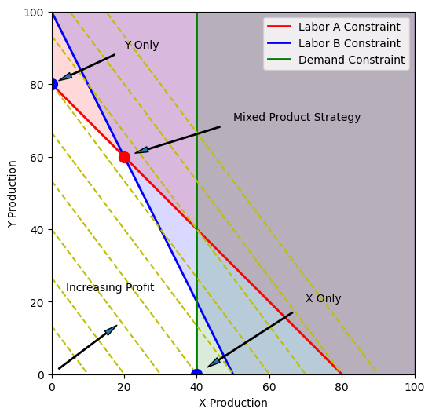

# Solving optimization problems with Pyomo/Gekko

Material from the following courses:  
https://www.udemy.com/course/optimization-with-python-linear-nonlinear-and-cplex-gurobi/
https://www.udemy.com/course/optimization-in-python/

<p align="center">
  
</p>


## TODO

## Running locally 

### Prerequisites

* Install WSL 2: https://learn.microsoft.com/en-us/windows/wsl/install
* Install anaconda: https://www.hostinger.com/tutorials/how-to-install-anaconda-on-ubuntu/
* Install git: https://www.digitalocean.com/community/tutorials/how-to-install-git-on-ubuntu-20-04
* Create ssh key ```ssh-keygen```and add it to your git repo https://gitlab.nzcorp.net/-/profile/keys

### Set up ENV
These are the steps to get started with the app:
1. Clone the repository `git@github.com:PriceTT/Solving-optimization-problems.git`.
2. Create the virtual environment using conda and poetry. The basic commands are as follows: 
    * Navigate to project folder and run the command below to the create conda environment which reads the environment.yml file.  
    ``` conda env create ```  
    * Activate the virtual environment  with
    ```conda activate opt-env```
    * Install the packages using poetry (retry if it fails)
    ``` poetry install -vvv  ```
    * To update the packages 
   ``` poetry update ```
    * To remove the env
   ``` conda env remove --name opt-env ```
   * The interpreter path can be found by tying  ```which python```

3. Once the environment is activated test with one of the notebooks.  


## Resources

https://jckantor.github.io/ND-Pyomo-Cookbook/notebooks/01.01-Installing-Pyomo.html# 

